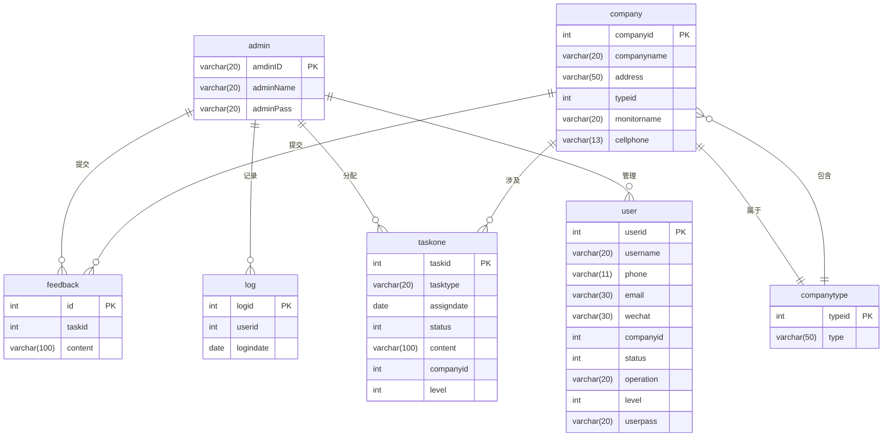

根据提供的数据库文件内容，以下是数据库 `internetsys` 的结构示意表。每个表的结构和字段信息如下：

### 数据库结构示意表

#### 表 `admin`
- **字段**:
    - `amdinID` (varchar(20)): 管理员ID，主键
    - `adminName` (varchar(20)): 管理员名称
    - `adminPass` (varchar(20)): 管理员密码

#### 表 `company`
- **字段**:
    - `companyid` (int(10)): 公司ID，主键，自增
    - `companyname` (varchar(20)): 公司名称
    - `address` (varchar(50)): 公司地址
    - `typeid` (int(10)): 公司类型ID
    - `monitorname` (varchar(20)): 监控人名称
    - `cellphone` (varchar(13)): 监控人电话

#### 表 `companytype`
- **字段**:
    - `typeid` (int(2)): 公司类型ID，主键，自增
    - `type` (varchar(50)): 公司类型描述

#### 表 `feedback`
- **字段**:
    - `id` (int(10)): 反馈ID，主键，自增
    - `taskid` (int(10)): 任务ID
    - `content` (varchar(100)): 反馈内容

#### 表 `log`
- **字段**:
    - `logid` (int(10)): 日志ID，主键，自增
    - `userid` (int(10)): 用户ID
    - `logindate` (date): 登录日期

#### 表 `taskone`
- **字段**:
    - `taskid` (int(10)): 任务ID，主键，自增
    - `tasktype` (varchar(20)): 任务类型
    - `assigndate` (date): 分配日期
    - `status` (int(1)): 任务状态
    - `content` (varchar(100)): 任务内容
    - `companyid` (int(10)): 公司ID
    - `level` (int(2)): 任务级别

#### 表 `user`
- **字段**:
    - `userid` (int(10)): 用户ID，主键，自增
    - `username` (varchar(20)): 用户名称
    - `phone` (varchar(11)): 用户电话
    - `email` (varchar(30)): 用户邮箱
    - `wechat` (varchar(30)): 用户微信
    - `companyid` (int(10)): 公司ID
    - `status` (int(11)): 用户状态
    - `operation` (varchar(20)): 用户操作
    - `level` (int(2)): 用户级别
    - `userpass` (varchar(20)): 用户密码

### 数据库结构图

为了更直观地展示数据库结构，可以使用Mermaid语法绘制实体关系图（ERD）。以下是Mermaid代码：

### 解释
- **实体关系**:
    - `admin` 表与 `feedback`、`log`、`taskone` 和 `user` 表之间是一对多的关系。
    - `company` 表与 `feedback` 和 `taskone` 表之间是一对多的关系。
    - `company` 表与 `companytype` 表之间是多对一的关系。
    - `companytype` 表与 `company` 表之间是一对多的关系。

通过上述结构示意表和实体关系图，可以清晰地了解数据库 `internetsys` 的结构和各个表之间的关系。